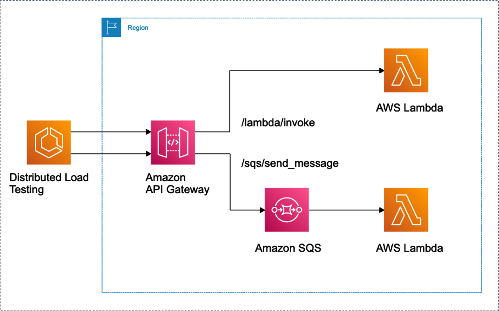

# Welcome to demo repository for DevAx Connect!



1. Clone this repository
```
 git clone https://github.com/dingyuanli/devax_connect_demo.git
```

2. Enter the folder

```
 cd devax_connect_demo
```

3. Bootstrap the project (prerequisite: [Install CDK](https://docs.aws.amazon.com/cdk/v2/guide/cli.html), AWS credential configuration)

```
 cdk bootstrap
```

4. Once the environment is bootrapped, you can now deploy the cdk.

```
 cdk deploy
```
5. Clean up
```
 cdk destory
```


## Useful commands

 * `cdk ls`          list all stacks in the app
 * `cdk synth`       emits the synthesized CloudFormation template
 * `cdk deploy`      deploy this stack to your default AWS account/region
 * `cdk diff`        compare deployed stack with current state
 * `cdk docs`        open CDK documentation

Enjoy!
